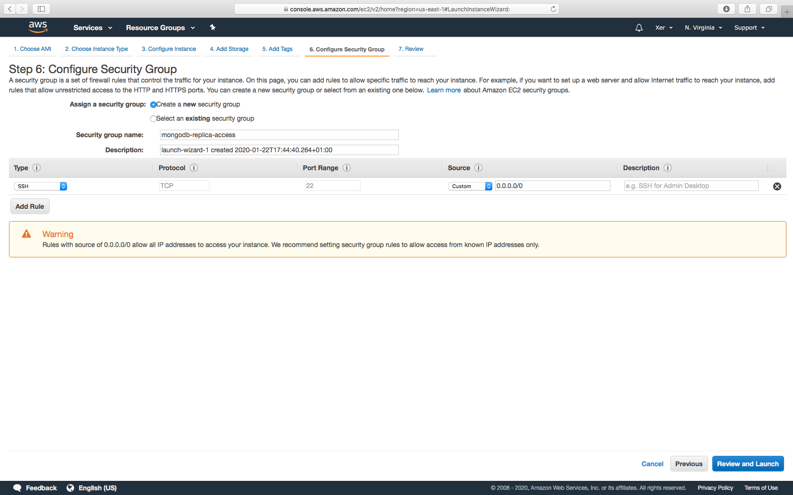
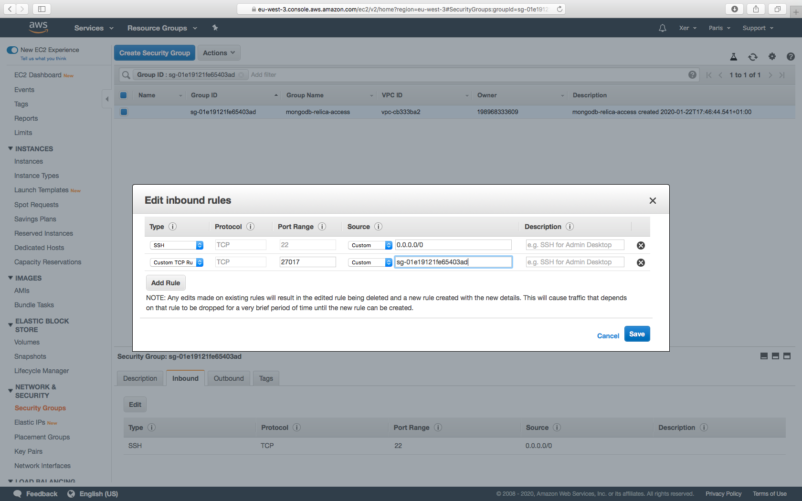
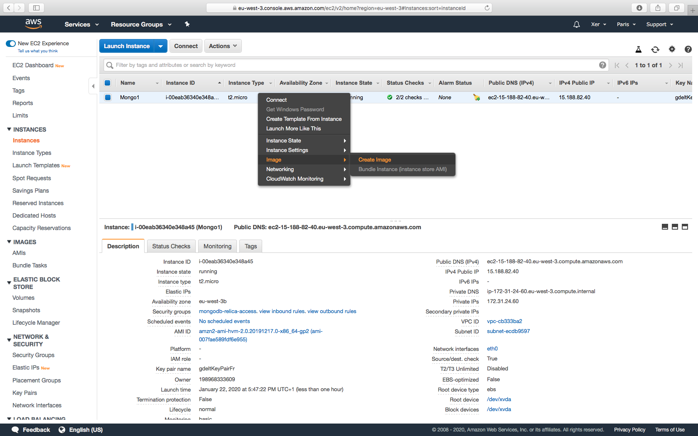
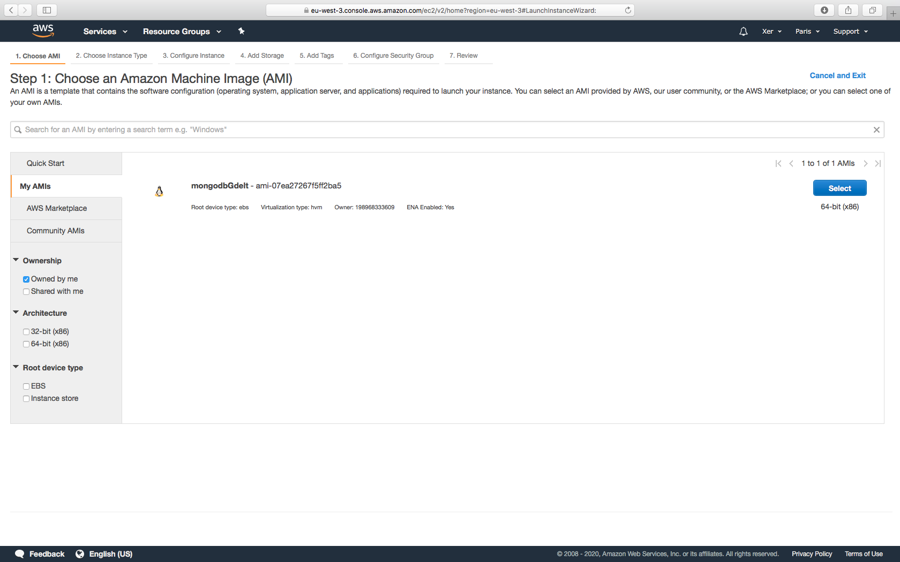
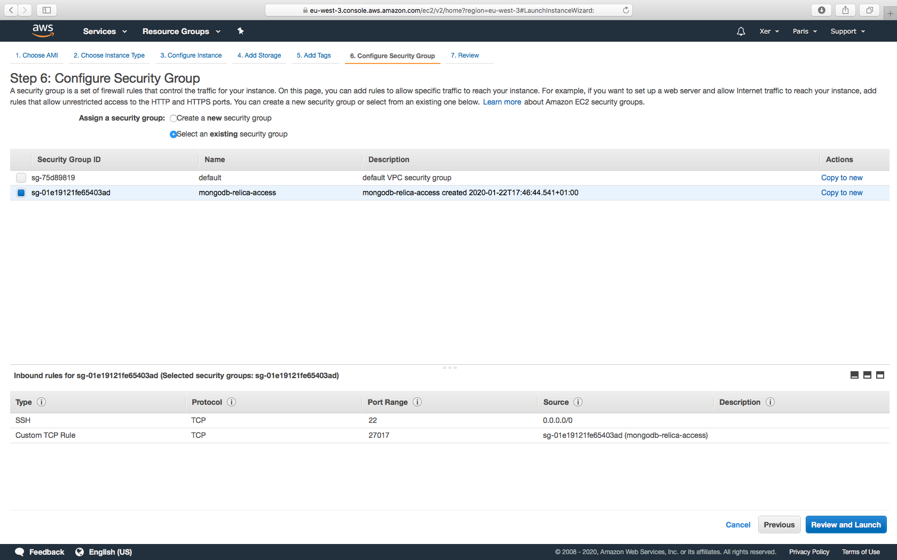

# Configuration Environment Mongodb
## EC2
#### Create a new instance "Amazon Linux 2 AMI (HVM), SSD Volume Type", in the step "Configure Security Group" create new group


#### After the instance is created, go to "Security group", edit the inbound rules add a new "custom TCP rule", and put the group id sg-xxx in the source


#### Config mongodb for one instance
- **login to the instance:**
```bash
ssh -i ~/xxxx.pem ec2-user@xxxx.xxxx.xxxx.xxxx (public ip)
```
- **update yum:**
```bash
sudo yum -y update
```
- **add mongodb repo:**
```shell script
sudo vim /etc/yum.repos.d/mongodb-org-4.2.repo
```
```shell script
[mongodb-org-4.2]
name=MongoDB Repository
baseurl=https://repo.mongodb.org/yum/amazon/2/mongodb-org/4.2/x86_64/
gpgcheck=1
enabled=1
gpgkey=https://www.mongodb.org/static/pgp/server-4.2.asc
```
- **install mongodb**
```shell script
sudo yum install -y mongodb-org
```
- **set auto start**
```shell script
sudo chkconfig mongod on
sudo service mongod start
```
- **connect to mongodb with the private ip**
```shell script
mongo --host xxxx.xxxx.xxxx.xxxx 
```

- **add user admin**
```shell script
use admin
db.createUser({ user: "admin", pwd: "password", roles: ["root"] })
```
- **create ssl key file**
```shell script
openssl rand -base64 741 > keyfile
```

- **put it in a folder for mongodb**
```shell script
sudo mkdir -p /opt/mongod
sudo mv keyfile /opt/mongod/
sudo chown mongod:mongod /opt/mongod/keyfile
sudo chmod 600 /opt/mongod/keyfile
```
- **change config of mongodb for replica set**
```shell script
sudo vi /etc/mongod.conf
```
```shell script
net:
  port: 27017
  bindIp: xxxx.xxxx.xxxx.xxxx   # (ec2 private ip) Enter 0.0.0.0,:: to bind to all IPv4 and IPv6 addresses or, alternatively, use the net.bindIpAll setting.

security:
  keyFile: /opt/mongod/keyfile

replication:
  replSetName: rsGdelt
```

#### Create AMI image


#### Create the other 2 instance with the AMI


#### Select the same group as the first instance


#### Login to the instance and change the bindIp with the the private ip and keep the same replSetName
```shell script
net:
  port: 27017
  bindIp: xxxx.xxxx.xxxx.xxxx   # (ec2 private ip) 
```
#EMR
#### create EMR cluster with spark/zeppelin installed
- **add spark mongodb connector int the config file of zeppelin**
```shell script
sudo vim /usr/lib/zeppelin/conf/zeppelin-env.sh
```
- **add the package in the SPARK_SUBMIT_OPTIONS**
```shell script
export SPARK_SUBMIT_OPTIONS="$SPARK_SUBMIT_OPTIONS --conf 'spark.executorEnv.PYTHONPATH=/usr/lib/spark/python/lib/py4j-src.zip:/usr/lib/spark/python/:<CPS>{{PWD}}/pyspark.zip<CPS>{{PWD}}/py4j-src.zip' --conf spark.yarn.isPython=true --packages org.mongodb.spark:mongo-spark-connector_2.11:2.2.7"
```
- **restart zeppelin**
```shell script
sudo /usr/lib/zeppelin/bin/zeppelin-daemon.sh restart
```
#########################