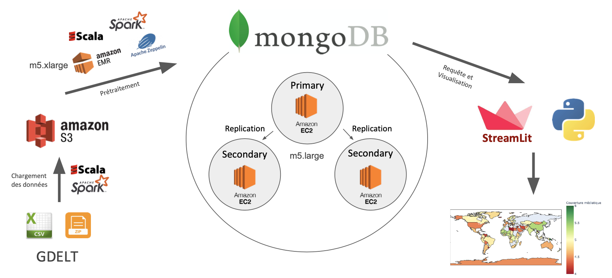
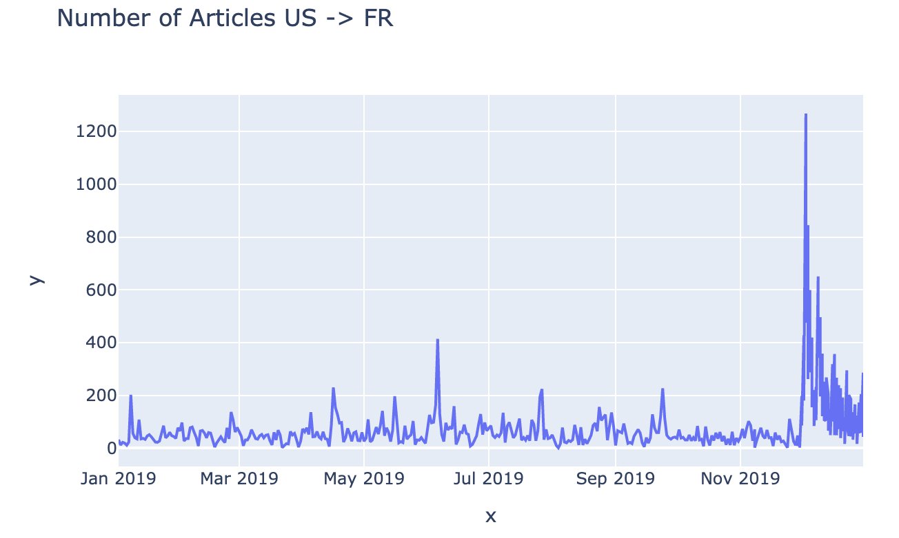
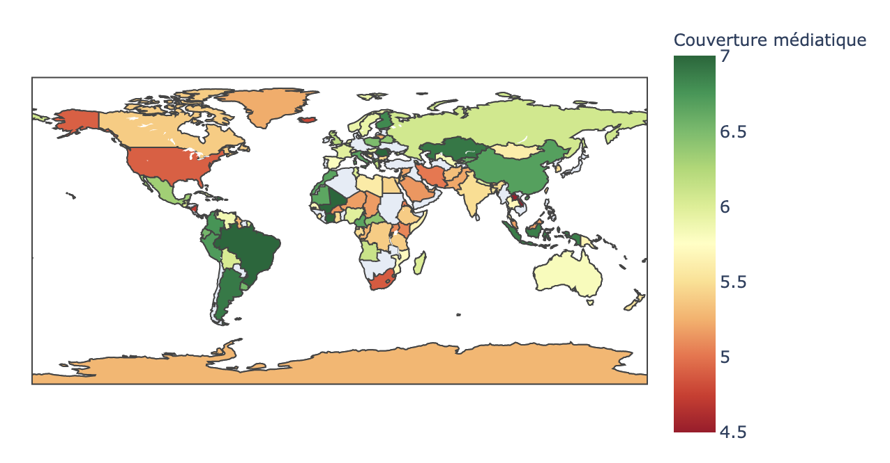

# GDELT Exploration

Projet réalisé dans le cadre de notre formation Mastère Spécialisé BigData 2019/2020 par : 
- Li XU
- Benyang SUN
- Jérémie PERES
- Kevin FERIN

## Introduction

" The Global Database of Events, Language, and Tone (GDELT), est une initiative pour construire un catalogue de comportements et de croyances sociales à travers le monde, reliant chaque personne, organisation, lieu, dénombrement, thème, source d’information, et événement à travers la planète en un seul réseau massif qui capture ce qui se passe dans le monde, le contexte, les implications ainsi que la perception des gens sur chaque jour".

Cette base de données a eu beaucoup d’utilisations, pour mieux comprendre l’évolution et l’impact de la crise financière du 2008 (Bayesian dynamic financial networks with time-varying predictors) ou analyser l’évolution des relations entre des pays impliquées dans des conflits (Massive Media Event Data Analysis to Assess World-Wide Political Conflict and Instability ).

L’objectif du projet est de concevoir un système qui permet d’analyser le jeu de donnees GDELT et ses sources de donnees.

## Objectif

L’objectif de ce projet est de proposer un système de stockage distribué, résilient et performant sur AWS pour repondre aux question suivantes:

- Afficher le nombre d’articles/évènements qu’il y a eu pour chaque triplet (jour, pays de l’évènement, langue de l’article).
- Pour un pays donné en paramètre, affichez les évènements qui y ont eu place triées par le nombre de mentions (tri décroissant); permettez une agrégation par jour/mois/année
- Pour une source de donnés passée en paramètre (gkg.SourceCommonName) affichez les thèmes, personnes, lieux dont les articles de cette sources parlent ainsi que le le nombre d’articles et le ton moyen des articles (pour chaque thème/personne/lieu); permettez une agrégation par jour/mois/année.
- Dresser la cartographie des relations entre les pays d’après le ton des articles : pour chaque paire (pays1, pays2), calculer le nombre d’article, le ton moyen (aggrégations sur Année/Mois/Jour, filtrage par pays ou carré de coordonnées)

## Architecture



## ETL

Le processus d'ETL des fichiers GDELT a été réalisé dans un Notebook Zeppelin, en utilisant Spark en Scala. Le Notebook est disponible dans le dossier [Notebooks](Notebooks)

## Webapp

La webapp a été réalisée en Python via la librairie [Streamlit](https://www.streamlit.io/). Le script Python de la webapp est disponible dans le dossier [Webapp](Webapp)

Ci-dessous quelques screenshots de la webapp :

**Nombre d'articles entre les US et la France en 2019**



**Couverture médiatique du monde (ie pour chaque pays la valeure moyenne de Nombre d'articles / Nombre d'événements)**



D'autres exemples de visualisation sont disponibles dans le dossier [Images](Images)


## Lancement de la webapp de visualisation

Après avoir chargé les données dans dans les collections MongoDB, lancez les lignes de code suivantes :

- **Clone du projet :**
```
git clone https://github.com/jeremieperes/MongoDB-Gdelt.git
```
- **Lancement de la web app :**
```
cd Webapp
streamlit run NoSQL-project-webapp.py
```

- **Visualisation :**
Ouvrir un navigateur puis :
```
locahost:8501
```
